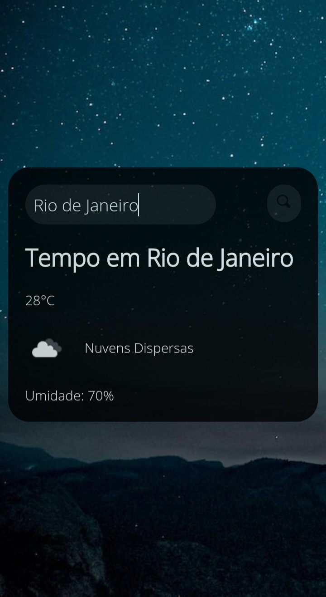

<h1 align="center"> APP Para verificar a Previsão do Tempo </h1>

Programa gratuito promovido pela DevClub.

  <a href="#-tecnologias">Tecnologias</a>&nbsp;&nbsp;&nbsp;|&nbsp;&nbsp;&nbsp;
  <a href="#-projeto">Projeto</a>&nbsp;&nbsp;&nbsp;|&nbsp;&nbsp;&nbsp;
  <a href="#-layout">Layout</a>&nbsp;&nbsp;&nbsp;|&nbsp;&nbsp;&nbsp;
  

 

   

## 🚀 Tecnologias

Esse projeto foi desenvolvido com as seguintes tecnologias:

- HTML  
- CSS
- GIT  
- JAVASCRIPT
- GITHUB
- APIs
## 💻 Projeto

O APP Previsão do Tempo usa uma API que consegue informar a previsão do tempo de qualquer lugar do mundo em tempo real.

- [visite o projeto online] (https://clemilsonchaves.github.io/previsao-tempo/)

   
